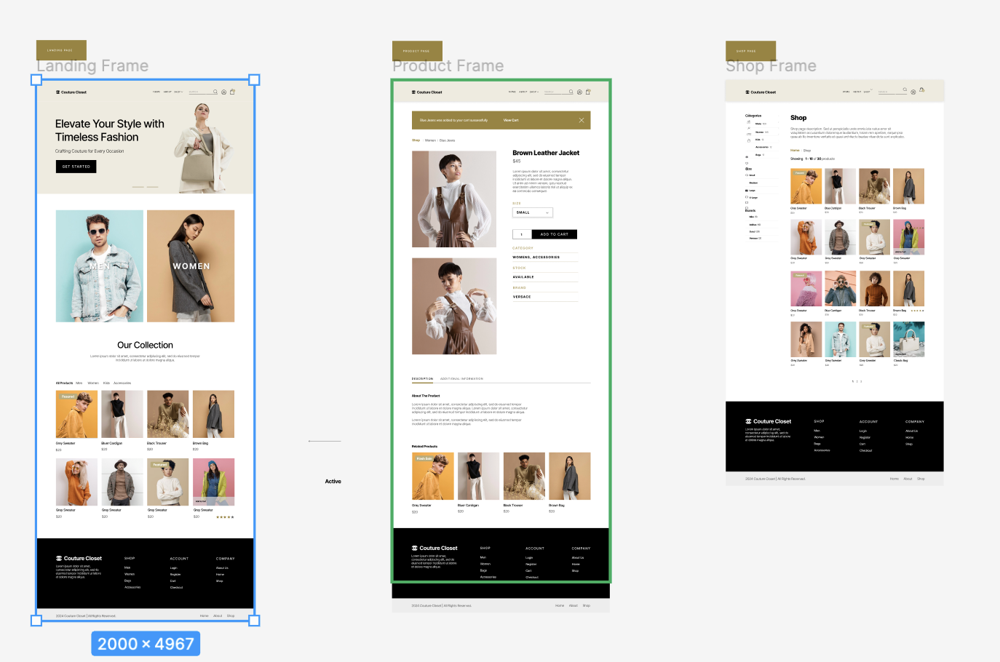
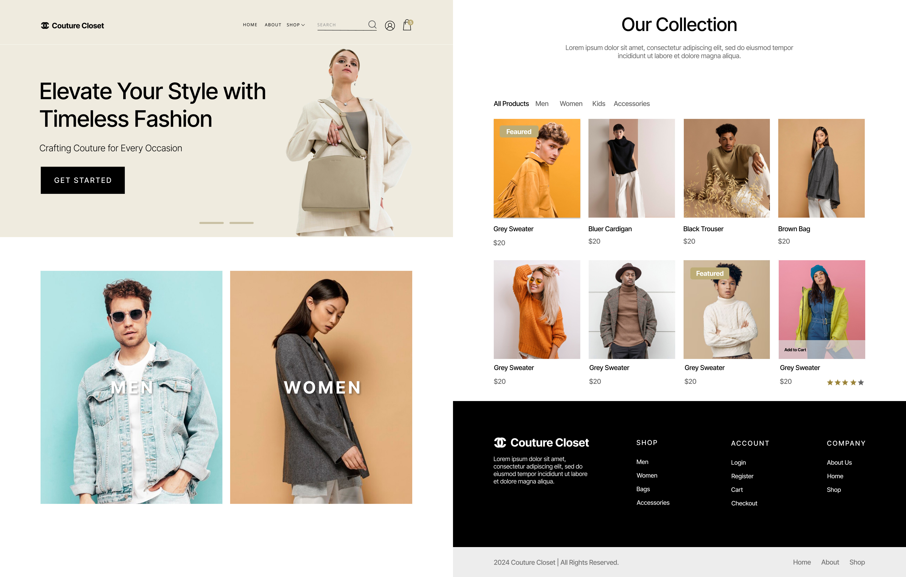
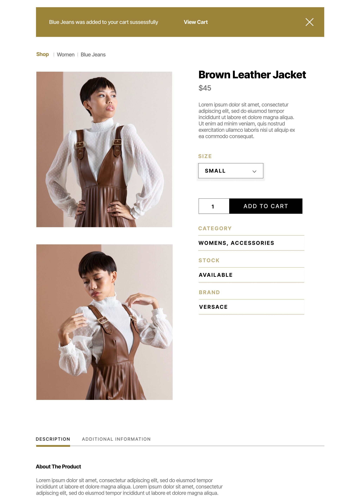
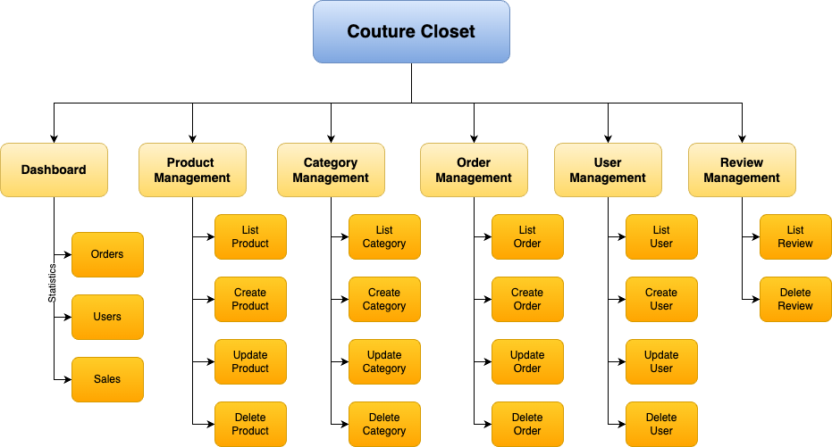
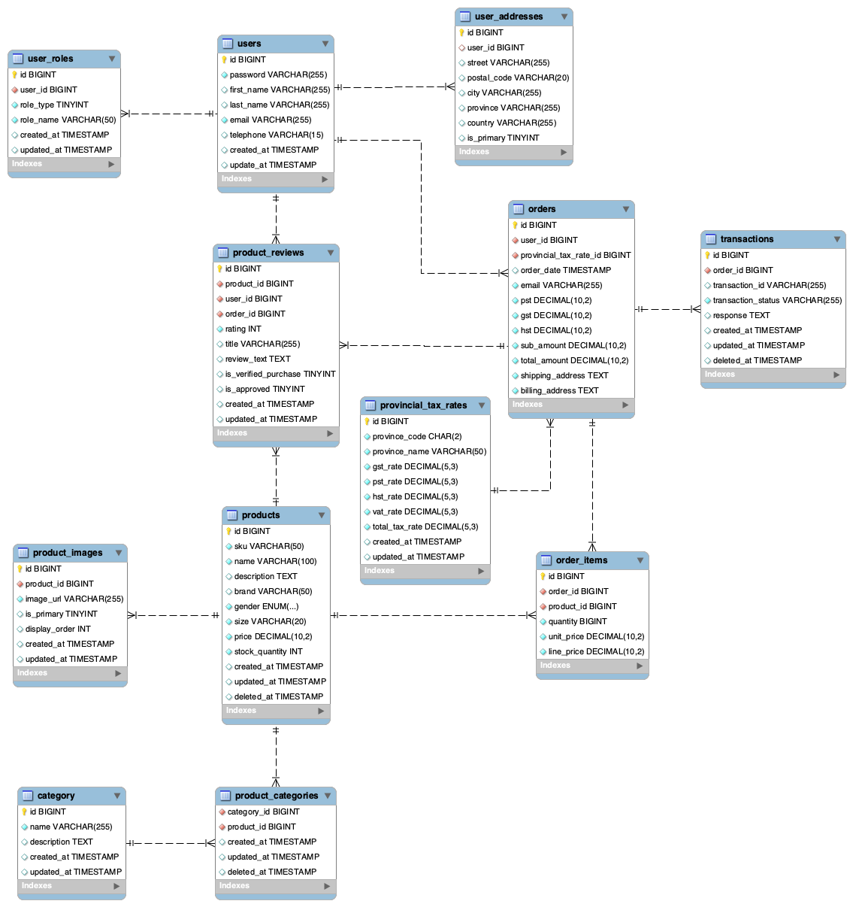

# Couture Closet Proposal

## 1. Introduction

This document outlines the detailed project proposal for the development of Couture Closet, an online fashion platform for men, women, and children.
This project, undertaken by Commerce Crew from WDD Development, aims to demonstrate our capabilities as a full-stack development studio by presenting this project to XYZ Marketing.
By leveraging Laravel, PHP, JavaScript, AWS, and MySQL, we intend to build a robust, secure, user-friendly, and responsive website that showcases our technical and collaborative skills.
The proposal encompasses the project scope, target audience, key features, technical stack, development team, and timeline, outlining the vision, technical approach, and collaborative roadmap to ensure successful implementation.

## 2. Target Audience & Market Analysis

* Couture Closet is an eCommerce platform offering stylish and affordable clothing for men, women, and children. Our target audience includes fashion-forward individuals, budget-conscious shoppers, and parents seeking fashionable, comfortable, and durable clothing for their children.
Target Market Segments
* Fashion-Forward Individuals: Seeking the latest trends and styles.
* Budget-Conscious Shoppers: Prioritizing affordability without sacrificing quality.
* Parents: Looking for stylish, comfortable, and durable clothing for their children.
* By catering to these segments, Couture Closet aims to be the go-to online destination for all clothing needs, providing a seamless shopping experience that combines trendiness, quality, and affordability.

## 3. Project Details

* This provides a brief overview of the type of features and functionality that the project will include.

* Our team will maintain time logs and will aim to complete the work before delivery deadlines. We will strive to fulfill all client requirements, applying new designs and technologies to enhance user experience, satisfaction, and easy navigation throughout the website. The site will be compatible with both modern and older technologies to ensure accessibility for all age groups. We will include functionality for returning customers to easily access their previous purchases and integrate links to social media accounts for promotion. The homepage will feature our top-selling products.

* The website will be responsive, ensuring usability on any device of any screen size, including desktops, laptops, tablets, and mobile phones. It will also be compatible with most browsers available in the market, including older versions except those older than IE 8. Users will be able to filter categories of their choice, with a focus on marketing clothes from various brands.

### Functionality

#### Front-End
- **Homepage (HOME):** Displaying featured products, new arrivals, and promotions.
- **Product Listing Page (SHOP):** Showing all products with filtering and sorting options.
- **Product Detail Page:** Detailed view of each product with images, descriptions, reviews, rating, and available sizes.
- **Shopping Cart:** Allowing users to add, remove, and update product quantities.
- **Checkout Process:** Seamless checkout experience with multiple payment options.
- **Responsive Design:** Ensuring usability across various devices (desktops, tablets, and mobile phones).
- **Login/register functionality**

#### Back-End
- **Admin Dashboard:** Managing products, categories, orders, and users.
- **PRODUCT Management:** Tracking product stock levels and updating quantities after purchases.
- **Category Management:** Men, Women, kids.
- **Order Management:** Processing orders, updating order status, and handling returns (USER: ONLY ADMIN).
- **USER MANAGEMENT:** Tracking list of customers (display of user table). CRUD functionality.
- **Review Management:** List of the feedback, reviews and rating from the users.

## 4. Proposed Design Solution
### General Layouts
Pages Previews

### The Landing Page
The landing page of couture closet will be used to showcase the main categories, and a list of our featured products. Along with slides and call to actions (CTA's) that will be used to get users to the Shop Listing and inner pages.

### The Shop Page (List View)
The shop anding page of couture closet will be used to showcase a  listing of all available products for purchase. It will also include demogrphic, size and brand filters.

### The Product Page (Detail View)
The product page (detail view) will have the information of the item to be purchased, including quantity and size filters, and the category, brand, and availability of the item to be purchased. This page will also have buttons to add the item to the cart for subsequent checkout.

## 5. User Personas/Use Case Diagrams

### User Personas

#### Guest User
- **Actions:** Browse products, view product details, and register an account.
- **Use Case:** 
  1. Visits the homepage.
  2. Browses through product categories.
  3. Views product details.
  4. Registers for an account.

#### Authenticated User
- **Actions:** All guest actions plus add to cart, checkout, and view order history.
- **Use Case:**
  1. Logs into the account.
  2. Adds products to the cart.
  3. Proceeds to checkout.
  4. Completes the purchase.
  5. Views order history.

#### Admin
- **Actions:** Manage products, categories, users, and orders.
- **Use Case:**
  1. Logs into the admin dashboard.
  2. Adds new products and updates existing ones.
  3. Manages user accounts and reviews orders.
  4. Updates order statuses and handles customer inquiries.

## 6. Sitemaps
### Font-End

### Back-End

## 7. Server

| Name      | Version |
| ----------| --------|
| Ubuntu    | 24.04   |
| MySQL     | 8.0.37  |
| Git       | 2.43.0  |
| PHP       | 8.3.6   |
| Apache    | 2.4.58  |
| NPM       | 10.7.0  |
| Node      | v18.20.4|
| Composer  | 2.7.7   |
| Laravel   | 11.9    |
| bootstrap | 5.2.3   |
| Zip       | 3.0     |

## 8. Security

### Server-Level Security
- Regular updates and patch management.
- Firewalls and access control lists (ACLs).
- Restricted permissions on root directory.
- SSH root access disabled.
- Firewall rules to close unnecessary ports.

### Application-Level Security
- **Password Encryption:** Using hashed passwords for secure storage.
- **XSS Protection:** Output sanitization and escaping to prevent cross-site scripting.
- **CSRF Protection:** Tokens and secure form submissions to prevent cross-site request forgery.
- **Authentication:** Different levels of authentication for admin, authenticated users, and unauthenticated users.
- **SQL Injection Prevention:** Prepared statements and parameterized queries to prevent SQL injection.

## 9. Database

### ERD

### Tables
- **users:** The users table contains core information about registered users, including their account credentials and personal details.
- **user_addresses:** The user_addresses table stores multiple shipping and billing addresses associated with each user account.
- **user_roles:** The user_roles table defines different levels of access and permissions for users within the system.
- **products:** The products table stores detailed information about individual clothing items, including their attributes and inventory status.
- **product_images:** The product_images table stores image information for each product.
- **product_reviews:** The product_reviews table that allows users to leave reviews for products they've purchased.
- **product_categories:** The product_categories table organizes products into a hierarchical structure of categories and subcategories.
- **category:** The category table to store all the categories.
- **provincial_tax_rates:** The provincial_tax_rates table store all Canadian provinces tax rates.
- **orders:** The orders table stores overall order information.
- **order_items:** The order_items table links orders to specific products and quantities.
- **transactions:** The transactions table tracks trasactions associated with each order.

## 10. Value Adds

The feature which adds value to the functionality is "Reviews". Users will be able to provide their reviews about the product, sharing their experience. Reviews are related to two entities of the database: users and products. Multiple reviews can be written about a product, and the same product can have multiple reviews from different users, helping other customers make informed purchase decisions. Admin can view all reviews related to a product and take appropriate action.

- **Customer Reviews and Ratings:** Allowing users to leave feedback and rate products.

## 11. Revised ERD for Value Adds

## 12. Team

### Team Name: Commerce Crew

All team members have equal contributions in programming and designing the database as well as designing the look and feel of the website from a customer perspective. Here is a brief description of our team, and the primary role served by each team member.

The Couture Closet development team, known as Commerce Crew, consists of experienced and skilled professionals dedicated to delivering a high-quality and functional eCommerce solution. Each member has made equal contributions to programming, database design, and the overall look and feel of the website from a customer perspective. Below is a brief description of our team and the primary roles served by each member:

- **Imran:** Project Management, Git, JavaScript, Checkout, Cart
- **Donald:** Design, HTML, CSS
- **Snigdha:** HTML, CSS
- **Rui:** Server Setup, Database, MySQL, Login, Register, Admin Dashboard
- **Parth:** QA, Testing, Bug Fixing

## 13. Timeline

### Day 1
- **Team Roles and Project Idea Pitch:** Completed by 12:00 PM
- **Configured Server:** Completed by 12:00 PM

### Day 2
- **Graphic Design:** Completed by 12:00 PM
- **Data Model:** Completed by 12:00 PM

### Day 3
- **HTML Templates:** Completed by 12:00 PM
- **Proposal:** Completed by 12:00 PM

### Day 12
- **Completed Site and Presentation:** Completed by 10:00 AM
- **Project Repo Submission:** Completed by 12:00 PM

## 13. Additional Requirements

- Physical items requiring shipment and delivery.
- Database tracking product quantities and adjusting after purchase.
- Displaying item stock levels to users.
- Implementing a shipping cost strategy.
- Applying taxes for each Canadian province or territory.
- Managing all data tables through CRUD operations.
- Ensuring original code development by team members.
- Equal contribution and collaboration among team members.
